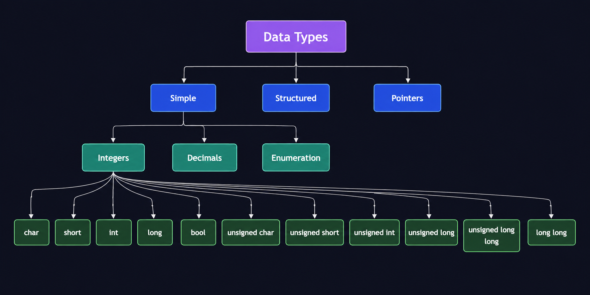

# Basic elements of C++


Dr. Danish Khan | dkhan@sdccd.edu


Press Space for next page

---

# Outline

<div class="normal-text">

- A typical C++ program
- Variables
- Data types & storage
- Arithmetic operations & precedence
- Variable assignments
- Programming style & example
- Debugging

</div>

---

# Navigation

Hover on the bottom-left corner to see the navigation's controls panel, [learn more](https://sli.dev/guide/ui#navigation-bar)

## Keyboard Shortcuts

|                                                     |                             |
| --------------------------------------------------- | --------------------------- |
| <kbd>right</kbd> / <kbd>space</kbd>                 | next animation or slide     |
| <kbd>left</kbd>  / <kbd>shift</kbd><kbd>space</kbd> | previous animation or slide |
| <kbd>up</kbd>                                       | previous slide              |
| <kbd>down</kbd>                                     | next slide                  |

<!-- https://sli.dev/guide/animations.html#click-animation -->

<p v-after class="absolute bottom-23 left-45 opacity-30 transform -rotate-10">Here!</p>

---

# What is a Computer Program?

<div class="definition-box">
A computer program is a set of instructions written in a programming language that tells a computer how to perform specific tasks or solve particular problems. These instructions are executed by the computer’s processor in a precise order, allowing it to process data, make decisions, and produce desired outputs.
</div>
---

# A typical C++ program

<div class="code-title">
slope.cpp | Calculating slope-intercept form of a straight line | Code page 1/2
</div>

```cpp {lines:true}
#include <iostream> 
	/* ⬆ Reads as Input/Output Stream. It’s part of the C++ Standard 		
	Library and allows your program to read input (from the keyboard) and write output 
	(to the console, files, etc.).*/

using namespace std;
	/* ⬆ Use standard library. You’re telling the compiler:
	“Don’t make me type std:: every time I use something from the standard library.” */

int main()		// Execution begins from the main. This is a function which return 0.
{				// start of the main function
	double y = 0.0;		
	/* ⬆ Allocate a memory location named y to store a decimal value, and initialize it to 0. */
	double x = 0; 	//The same concept applies here, but with a different memory location name.
	double constant = 0;
	double slope = 0;
	
	y = constant + (slope * x);
	/* ⬆ The calculation is performed from right to left, and the result is stored in the memory location y 
	as a decimal value. */
```

---

<div class="code-title">
Code page 2/2
</div>

```cpp {lines:true}
	cout << "The value of y is "<< y << endl;
	/* ⬆ cout (character output) is used to display text on the console. The << insertion operator 
	sends data into the output stream, which in this case is the screen.*/
	
	return 0;
	/* ⬆ In C++, the function main() must return an integer (int).
    return 0; ends the program and sends the value 0 back to the operating system (OS). */

} //end of main function
```

---

# Memory mapping under the hood

<div class="grid grid-cols-2 gap-10 mt-10">

<div>
<div class="normal-text" style="font-size: 1.3rem !important;">
<ul class="leading-relaxed space-y-1">
  <li>Variables are meant to be human-friendly names</li>
  <li>Computer identifies location of a variable with a memory address</li>
  <li>Addresses are reusable</li>
  <li>Contiguous or non-contiguous</li>
  <li>Every variable is allocated a fixed block of memory</li>
</ul>
</div>
</div>

<div>

<table class="memory-table">
  <thead>
    <tr>
      <th>Variable<br>address</th>
      <th>Variable name</th>
      <th>Variable value</th>
    </tr>
  </thead>
  <tbody>
    <tr>
      <td>0x7ffeec6d47a0</td>
      <td>y</td>
      <td>0</td>
    </tr>
    <tr>
      <td>0x7ffeec6d4798</td>
      <td>x</td>
      <td>0</td>
    </tr>
    <tr>
      <td>0x7ffeec6d4790</td>
      <td>constant</td>
      <td>0</td>
    </tr>
    <tr>
      <td>0x7ffeec6d4788</td>
      <td>slope</td>
      <td>0</td>
    </tr>
  </tbody>
</table>

</div>

</div>
---

# Variables and memory addresses

<div class="definition-box">
"Printing memory addresses isn’t always necessary, but at times it can be useful to observe how the compiler allocates memory."
</div>

<div class="code-title">
The address operator & placed before a variable prints its memory address
</div>

```cpp {lines:true}
cout << "The address of y is "<< &y << endl;
cout << "The value of x is "<< &x << endl;
cout << "The value of constant is "<< &constant << endl;
cout << "The value of slope is "<< &slope << endl;
```

---

# Data types

<div class="normal-text">
We encounter various data types in real-world applications, such as integers, decimals, booleans (true/false), and many others.
</div>

<div class="definition-box">
"A data type defines the kind of value a variable can hold and the operations that can be performed on it."
</div>

---

# Data types

<div class="flex justify-center mt-6">
  
</div>

---

# Data types storage and range

<div class="normal-text">

<ul>
  <li>Each data type takes some space in memory and allows different ranges of values</li>

  <li>Different compilers may allow different ranges of values. Check your compiler documentation.</li>

  <li>
    The <code>&lt;climits&gt;</code> header in C++ 
    (or <code>&lt;limits.h&gt;</code> in C) provides constants that describe 
    the minimum and maximum values each fundamental integral type can hold.
  </li>
</ul>

</div>

---

# Data type ranges in C++

<div class="code-title">
Using limits standard library header
</div>

```cpp {lines:true}
#include <iostream>
#include <limits>
using namespace std;

int main() {
    cout << "int range: "
         << numeric_limits<int>::min() << " to "
         << numeric_limits<int>::max() << endl;

    cout << "double lowest: " << numeric_limits<double>::lowest() << endl;
    cout << "double min (smallest positive): " << numeric_limits<double>::min() << endl;
    cout << "double max: " << numeric_limits<double>::max() << endl;
    cout << "double infinity: " << numeric_limits<double>::infinity() << endl;
    return 0;
}
```

---

# Data type ranges in C++
<div class="code-title">
Output
</div>

```
int range: -2147483648 to 2147483647
double lowest: -1.79769e+308
double min (smallest positive): 2.22507e-308
double max: 1.79769e+308
double infinity: inf
```

---

# Data type sizes

<div class="grid grid-cols-[30%_70%] gap-10 mt-6">

<!-- LEFT COLUMN -->
<div>

<table class="memory-table">
  <thead>
    <tr>
      <th>Data type</th>
      <th>Size in bytes</th>
    </tr>
  </thead>
  <tbody>
    <tr>
      <td>char</td>
      <td>1</td>
    </tr>
    <tr>
      <td>bool</td>
      <td>1</td>
    </tr>
    <tr>
      <td>short</td>
      <td>2</td>
    </tr>
    <tr>
      <td>int</td>
      <td>4</td>
    </tr>
    <tr>
      <td>float</td>
      <td>4</td>
    </tr>
    <tr>
      <td>long</td>
      <td>8</td>
    </tr>
  </tbody>
</table>

</div>

<!-- RIGHT COLUMN -->
<div>

<div class="flex justify-between items-center">
  <span class="code-title">
    Example code shows data type and memory allocation
  </span>

</div>

```cpp {1-20|1-2|4|5-6|8-16|19-20}{lines:true}
#include <iostream>
using namespace std;

int main() {
    cout << "Data type sizes in C++ (in bytes):" << endl;
    cout << "-------------------------------" << endl;

    cout << "char: " << sizeof(char) << " byte(s)" << endl;
    cout << "bool: " << sizeof(bool) << " byte(s)" << endl;
    cout << "short: " << sizeof(short) << " byte(s)" << endl;
    cout << "int: " << sizeof(int) << " byte(s)" << endl;
    cout << "long: " << sizeof(long) << " byte(s)" << endl;
    cout << "long long: " << sizeof(long long) << " byte(s)" << endl;
    cout << "float: " << sizeof(float) << " byte(s)" << endl;
    cout << "double: " << sizeof(double) << " byte(s)" << endl;
    cout << "long double: " << sizeof(long double) << " byte(s)" << endl;
    cout << "wchar_t: " << sizeof(wchar_t) << " byte(s)" << endl;

    return 0;
}
```

</div>

</div>


---

# Tokens

<div class="definition-box">
"Special characters and keywords carry reserved meanings and are applied according to strict formatting rules."
</div>
<br>
<div class="normal-text" style="font-size: 1.2rem !important;">

  <li><strong>Keywords</strong> → Reserved words that have special meaning in C++.</li>

  <li><strong>Identifiers</strong> → Names given to variables, functions, classes, etc.</li>

  <li><strong>Literals</strong> → Fixed values that do not change during program execution.</li>

  <li><strong>Operators</strong> → Symbols that perform operations on operands.</li>

  <li><strong>Punctuators</strong> → Characters that have syntactic meaning.</li>

  <li><strong>Comments</strong> → Ignored by compiler, but still considered tokens during lexical analysis.</li>

</div>
---

# Tokens example code

<div class="code-title">
Example code shows tokens in C++
</div>

```cpp {lines:true}
#include <iostream>   // Preprocessor directive (not a token, but expands before tokens)

using namespace std;  // Keywords: using, namespace

int main() {          // Keyword: int, Identifier: main, Punctuators: () {
    // ⬇️⬇️⬇️ Identifiers, Literals, Operators, Punctuators ⬇️⬇️⬇️
    int a = 10;       // Keyword: int | Identifier: a | Operator: = | Literal: 10 | Punctuator: ;
    int b = 20;       // Keyword: int | Identifier: b | Operator: = | Literal: 20 | Punctuator: ;

    int sum = a + b;  // Identifier: sum | Operators: =, + | Identifiers: a, b

    // ⬇️⬇️⬇️ String Literal ⬇️⬇️⬇️
    cout << "Sum = " << sum << endl; 
    // Identifier: cout | Operators: << | String literal: "Sum = " | Identifier: sum | Identifier: endl

    return 0;         // Keyword: return | Literal: 0
}   // Punctuators: }
```

---

# Arithmetic operations

<div class="definition-box">
Arithmetic operators behave differently in different programming languages.
</div>
<br>
<div class="normal-text">
<b>Integer division</b> between integers truncates toward zero.
<code>5 / 2 </code> -> 2
<br>
<b>Modulo</b> / <b>Remainder</b> operator takes the sign of the dividend.
<code>-5 % 2</code> -> -1
<br>
<code>-5 % 2</code> -> 1, in Python, Modulo result has the sign of the divisor.

</div>
---

# Order of precedence

<div class="definition-box">
Order of precedence (also called operator precedence) refers to the priority rules that determine the sequence in which different operators are evaluated in an expression.
</div>

$$
2 + 3 \times 4 = 14 \tag{1}
$$

$$
2 + 3 \times 4 \neq 20 \tag{2}
$$

<div class="definition-box">
Parentheses override the order of precedence.
</div>

$$
(2 + 3) \times 4 = 20 \tag{3}
$$

---

# Order of precedence table

<div class="scroll-table">
<table class="precedence-table">
<thead>
<tr>
<th>Precedence</th>
<th>Operators</th>
<th>Assoc.</th>
</tr>
</thead>
<tbody>
<tr>
<td>1</td>
<td>( )</td>
<td>L → R</td>
</tr>
<tr>
<td>2</td>
<td>++, --, + (unary), - (unary), !, ~, *, &amp;</td>
<td>R → L</td>
</tr>
<tr>
<td>3</td>
<td>*, /, %</td>
<td>L → R</td>
</tr>
<tr>
<td>4</td>
<td>+, -</td>
<td>L → R</td>
</tr>
<tr>
<td>5</td>
<td>&lt;&lt;, &gt;&gt;</td>
<td>L → R</td>
</tr>
<tr>
<td>6</td>
<td>&lt;, &lt;=, &gt;, &gt;=</td>
<td>L → R</td>
</tr>
<tr>
<td>7</td>
<td>==, !=</td>
<td>L → R</td>
</tr>
<tr>
<td>8</td>
<td>&amp;</td>
<td>L → R</td>
</tr>
<tr>
<td>9</td>
<td>^</td>
<td>L → R</td>
</tr>
<tr>
<td>10</td>
<td>|</td>
<td>L → R</td>
</tr>
<tr>
<td>11</td>
<td>&amp;&amp;</td>
<td>L → R</td>
</tr>
<tr>
<td>12</td>
<td>||</td>
<td>L → R</td>
</tr>
<tr>
<td>13</td>
<td>?:</td>
<td>R → L</td>
</tr>
<tr>
<td>14</td>
<td>= += -= *= /= %= <br>(assignment operators) </td>
<td>R → L</td>
</tr>
</tbody>
</table>
</div>

---

# Order of Precedence Example

<div class="normal-text" style="font-size: 1.2rem !important;">

Apply order of precedence rules (multiplication & division have the highest priorities).

</div>

$$
3 \times 7 - 6 + 2 \times 5 \div 4 + 6 \tag{4}
$$

<div class="normal-text" style="font-size: 1.2rem !important;">

Multiplication applies first since equal-precedence operators are evaluated left to right. Check the Precedence table.

</div>

$$
21 - 6 + 10 \div 4 + 6 \tag{5}
$$

<div class="normal-text" style="font-size: 1.2rem !important;">
  Next priority is division → apply integer division to expression (5). 
  Note this is an 
  <span style="color:#f5d442; display:inline-flex; align-items:center; gap:4px; font-weight:bold;">
    integer division
    <VTooltip>
      <span style="cursor:help;">💬</span>
      <template #popper>
        Since both operands are integers, C++ performs integer division. 
        Therefore, 10 / 4 evaluates to 2 rather than 2.5.
      </template>
    </VTooltip>
  </span>
</div>


$$
21 - 6 + 2 + 6 \tag{6}
$$

<div class="normal-text" style="font-size: 1.2rem !important;">

Apply order of precedence to expression (6): addition and subtraction have the same precedence and are evaluated from left to right.

</div>

$$
23 \tag{7}
$$

---

# Order of Precedence in other languages

<div class="definition-box">
Order of precedence can vary slightly across programming languages, though most mainstream languages (C, C++, Java, Python, JavaScript) follow very similar precedence rules.
</div>

---

# Did you know?

$$
5 + 4 = 9 \tag{7}
$$

$$
'5' + '4' = 105 \tag{8}
$$

<div class="definition-box">
"Expression 7 is Integer Arithmetic whereas expression 8 is Character Arithmetic."
</div>
<br>
<div class="normal-text" style="font-size: 1.5rem !important;">
<ul>
  <li><code>5</code> is an integer, while <code>'4'</code> is a character.</li>
  <li>The integer value of <code>'5'</code> is 53 and <code>'4'</code> is 52 — their <span style="color:#f5d442; display:inline-flex; align-items:center; gap:4px; font-weight:700;">ASCII codes <VTooltip><span style="cursor:help;">💬</span><template #popper>ASCII stands for American Standard Code for Information Interchange. It assigns a unique integer value to characters such as letters, digits, punctuation, and control symbols. Computers use these numbers to represent and store text.</template></VTooltip></span></li>
</ul>
</div>

---

# Variable Assignments

<div class="definition-box">
Variables are like spaces in a refrigerator (memory), where each shelf or container is designed to hold a specific type of item.
</div>

<div class="grid grid-cols-[24%_76%] gap-6 mt-5">

<div>
  
</div>

<div>

<div class="text-2xl mb-4 border-b-2 border-blue-600 pb-1 text-purple-300 font-bold">
Terminologies
</div>

<div class="normal-text" style="font-size: 1.05rem !important; line-height: 1.4;">

<div class="mb-4">
<span class="text-green-400 font-bold">Declaration ➜</span>
telling the compiler the variable's name and data type. For example, 
<span class="text-yellow-300">int my_variable;</span>
</div>

<div class="mb-4">
<span class="text-green-400 font-bold">Assignment ➜</span>
putting a value into an existing variable.
<span class="text-yellow-300">my_variable = 10;</span>
</div>

<div class="mb-4">
<span class="text-green-400 font-bold">Initialization ➜</span>
giving a variable its first value when it is declared. For example, 
<span class="text-yellow-300">int my_variable = 10;</span>
</div>

<div>
<span class="text-green-400 font-bold">Reassignment ➜</span>
changing the value already stored in a variable.
<span class="text-yellow-300">my_variable = 56;</span>
</div>

</div>

</div>
</div>

---

# Guidelines for Using Variables in C++

<table class="w-full border-collapse text-[0.9rem] mt-3">
<thead>
<tr class="bg-blue-700 text-white text-lg">
  <th class="w-1/2 border border-gray-300 px-3 py-2 text-left font-normal">✅ Do</th>
  <th class="w-1/2 border border-gray-300 px-3 py-2 text-left font-normal">❌ Don’t</th>
</tr>
</thead>

<tbody class="text-center">

<tr>
  <td class="border border-gray-300 px-3 py-2">
    Declare variables <span class="text-orange-300 font-bold">before use</span>
  </td>
  <td class="border border-gray-300 px-3 py-2">
    Use undeclared variables
  </td>
</tr>

<tr>
  <td class="border border-gray-300 px-3 py-2">
    <span class="text-orange-300 font-bold">Initialize</span> variables before use
  </td>
  <td class="border border-gray-300 px-3 py-2">
    Leave variables uninitialized
  </td>
</tr>

<tr>
  <td class="border border-gray-300 px-3 py-2">
    Use <span class="text-orange-300 font-bold">meaningful names</span>
    (e.g., <span class="font-mono text-yellow-300">temperatureCelsius</span>)
  </td>
  <td class="border border-gray-300 px-3 py-2">
    Use vague names
    (<span class="font-mono">x, y, temp</span>)
  </td>
</tr>

<tr>
  <td class="border border-gray-300 px-3 py-2">
    Use <span class="font-mono text-blue-400 font-bold">const</span>
    for values that should not change
  </td>
  <td class="border border-gray-300 px-3 py-2">
    Make constant values modifiable
  </td>
</tr>

<tr>
  <td class="border border-gray-300 px-3 py-2">
    Keep variables in <span class="text-orange-300 font-bold">small scope</span>
  </td>
  <td class="border border-gray-300 px-3 py-2">
    Overuse global variables
  </td>
</tr>

<tr>
  <td class="border border-gray-300 px-3 py-2">
    Choose the <span class="text-orange-300 font-bold">appropriate type</span>
    (<span class="font-mono text-green-400">int, double</span>)
  </td>
  <td class="border border-gray-300 px-3 py-2">
    Use inappropriate data types
  </td>
</tr>

<tr>
  <td class="border border-gray-300 px-3 py-2">
    Replace magic numbers with
    <span class="text-orange-300 font-bold">named constants</span>
  </td>
  <td class="border border-gray-300 px-3 py-2">
    Hardcode unexplained values
  </td>
</tr>

<tr>
  <td class="border border-gray-300 px-3 py-2">
    Remember C++ identifiers are
    <span class="text-orange-300 font-bold">case-sensitive</span>
    (<span class="font-mono">value ≠ Value</span>)
  </td>
  <td class="border border-gray-300 px-3 py-2">
    Assume different cases mean the same variable
  </td>
</tr>

</tbody>
</table>


---

# Guidelines of Using Variables in C++

<div class="definition-box" style="font-size: margin-top: 20px !important;">
Declare variables early, name clearly, initialize immediately, and keep the scope as tight as possible.
</div>

---

# Variable Naming Conventions

<table class="w-full border-collapse text-[0.85rem] mt-3">
<thead>
<tr class="bg-blue-700 text-white text-lg">
  <th class="w-[23%] border border-gray-300 px-3 py-2 text-left font-normal">✅ Convention</th>
  <th class="w-[25%] border border-gray-300 px-3 py-2 text-left font-normal">Example</th>
  <th class="w-[52%] border border-gray-300 px-3 py-2 text-left font-normal">Guideline</th>
</tr>
</thead>

<tbody class="text-center">

<tr>
  <td class="border border-gray-300 px-3 py-2">camelCase</td>
  <td class="border border-gray-300 px-3 py-2">
    <span class="font-mono text-yellow-300">studentCount</span>
  </td>
  <td class="border border-gray-300 px-3 py-2">
    Common style for variable and function names
  </td>
</tr>

<tr>
  <td class="border border-gray-300 px-3 py-2">snake_case</td>
  <td class="border border-gray-300 px-3 py-2">
    <span class="font-mono text-yellow-300">student_count</span>
  </td>
  <td class="border border-gray-300 px-3 py-2">
    Words are separated by underscores
  </td>
</tr>

<tr>
  <td class="border border-gray-300 px-3 py-2">PascalCase</td>
  <td class="border border-gray-300 px-3 py-2">
    <span class="font-mono text-green-400">BankAccount</span>
  </td>
  <td class="border border-gray-300 px-3 py-2">
    Common style for class and struct names
  </td>
</tr>

<tr>
  <td class="border border-gray-300 px-3 py-2">UPPER_CASE</td>
  <td class="border border-gray-300 px-3 py-2">
    <span class="font-mono text-blue-400">MAX_USERS</span>
  </td>
  <td class="border border-gray-300 px-3 py-2">
    Often used for constants and macros
  </td>
</tr>

<tr>
  <td class="border border-gray-300 px-3 py-2">
    Valid first character
  </td>
  <td class="border border-gray-300 px-3 py-2">
    <span class="font-mono text-yellow-300">count</span>,
    <span class="font-mono text-yellow-300">_count</span>
  </td>
  <td class="border border-gray-300 px-3 py-2">
    Must begin with a letter or underscore, not a digit
  </td>
</tr>

<tr>
  <td class="border border-gray-300 px-3 py-2">
    Meaningful names
  </td>
  <td class="border border-gray-300 px-3 py-2">
    <span class="font-mono text-yellow-300">temperatureCelsius</span>
  </td>
  <td class="border border-gray-300 px-3 py-2">
    Describe what the variable represents
  </td>
</tr>

<tr>
  <td class="border border-gray-300 px-3 py-2">
    Avoid C++ keywords
  </td>
  <td class="border border-gray-300 px-3 py-2">
    <span class="font-mono text-red-400">int class; ❌</span>
  </td>
  <td class="border border-gray-300 px-3 py-2">
    Reserved keywords cannot be identifiers
  </td>
</tr>

<tr>
  <td class="border border-gray-300 px-3 py-2">
    Case-sensitive
  </td>
  <td class="border border-gray-300 px-3 py-2">
    <span class="font-mono text-yellow-300">value</span>,
    <span class="font-mono text-green-400">Value</span>,
    <span class="font-mono text-blue-400">VALUE</span>
  </td>
  <td class="border border-gray-300 px-3 py-2">
    These are three different identifiers
  </td>
</tr>

</tbody>
</table>

---
layout: two-cols
layoutClass: gap-8
---
# Type Conversion in C++

<div class="definition-box" style="font-size: 1.25rem !important;">
Type conversion occurs when a value of one data type is converted to another.
</div>

::left::

## Implicit Conversion

- <span class="font-mono text-yellow-300">int + char</span> → char is promoted to an integer value.
- <span class="font-mono text-yellow-300">y - '0'</span> → computes the numeric value represented by a digit character.
- <span class="font-mono text-yellow-300">int + float</span> → int is converted to float before arithmetic.

::right::

<div class="code-title">
Example code shows data type and memory allocation
</div>

```cpp {lines:true}
#include <iostream>
using namespace std;

int main() {
    int x = 5;
    char y = '3'; // ASCII value is 51

    cout << x + y << '\n';          // 56
    cout << x + (y - '0') << '\n';  // 8

    float z = 2.5f;
    cout << x + z << '\n';          // 7.5

    return 0;
}
```

---
layout: two-cols
layoutClass: gap-12
---

# Types of Conversion

::left::

## Implicit Conversion

<div class="normal-text-small">

- Performed **automatically** by the compiler.

- Common when an expression contains different data types.

- The compiler converts a value to a compatible type when required.

</div>

<div class="code-title" style="margin-top: 4px;">
Example: Implicit conversion
</div>

```cpp {lines:true}
int x = 5;
double y = 2.5;

cout << x + y << endl;   // 7.5
// x is temporarily converted from int to double 
// before the addition.
```


::right::

## Explicit Conversion (Casting)

<div class="normal-text-small">

- Requested **explicitly** by the programmer.

- Modern C++ provides casting operators such as `static_cast`.

</div>

### Syntax

```cpp
static_cast<data_type>(expression)
```

<div class="code-title" style="margin-top: 4px;">
Example: Explicit conversion
</div>

```cpp {lines:true}
int total = 7;
int count = 2;

double average =
    static_cast<double>(total) / count;

// average = 3.5
// total is explicitly converted from int 
// to double, causing floating-point division.
```

---

# Explicit Conversion Example

<div class="code-title">
Using static_cast in C++
</div>

<div class="h-[390px] overflow-y-auto pr-2">

```cpp {lines:true}
#include <iostream>
using namespace std;

int main() {
    int total = 7;
    int count = 2;

    // Integer division
    cout << "Without casting: "
         << total / count << endl;

    // Explicit conversion
    double average =
        static_cast<double>(total) / count;

    cout << "With casting: "
         << average << endl;

    // double -> int
    double price = 15.75;

    cout << "Converted to int: "
         << static_cast<int>(price) << endl;

    return 0;
}
```

<div class="code-title" style="margin-top: 6px;">
Output
</div>

```text
Without casting: 3
With casting: 3.5
Converted to int: 15
```

</div>


---

# Programming Style

<div class="definition-box" style="font-size: 1.35rem !important; margin-top: 20px !important;">
Poorly formatted code is like messy handwriting — the compiler may understand it, but other programmers may struggle to read it.
</div>

<div class="code-title">
Improperly formatted code
</div>

```cpp {lines:true}
#include <iostream>
using namespace std;

int main(){int a=10;int b=20;int sum=a+b;
cout<<"Sum = "<<sum<<endl;return 0;}
```

<div class="normal-text-small">

The program is **syntactically correct**, but poor spacing, indentation, and line organization make the code difficult to read and maintain.

</div>

---

# Programming Style

<div class="code-title">
Properly formatted code
</div>

```cpp {lines:true}
#include <iostream>     // Preprocessor directive

using namespace std;    // using and namespace are keywords

int main() {            // int: keyword | main: identifier

    int a = 10;         // variable declaration and initialization
    int b = 20;

    int sum = a + b;    // = assignment | + arithmetic operator

    cout << "Sum = " << sum << endl;
                        // "Sum = " is a string literal

    return 0;
}
```

<div class="normal-text-small">

Proper formatting uses consistent **indentation, spacing, line breaks, and organization**, making the program easier to read, debug, and maintain.

</div>

---

# Debugging

<div class="definition-box" style="margin-top: 70px !important; text-align: center;">
The best way to learn debugging is by doing it.

<br>

&

<br>

Great coders aren't born — they debug their way there.
</div>

---

# Compile-Time vs. Run-Time Errors

<table class="w-full border-collapse text-[0.88rem] mt-5">
<thead>
<tr class="bg-blue-700 text-white text-lg">
  <th class="w-[14%] border border-gray-300 px-3 py-3 text-left font-normal">Aspect</th>
  <th class="w-[43%] border border-gray-300 px-3 py-3 text-left font-normal">Compile-Time Error</th>
  <th class="w-[43%] border border-gray-300 px-3 py-3 text-left font-normal">Run-Time Error</th>
</tr>
</thead>

<tbody class="text-center">

<tr>
  <td class="border border-gray-300 px-3 py-3 font-bold">
    When?
  </td>
  <td class="border border-gray-300 px-3 py-3">
    Before execution, while the program is being compiled
  </td>
  <td class="border border-gray-300 px-3 py-3">
    While the compiled program is executing
  </td>
</tr>

<tr>
  <td class="border border-gray-300 px-3 py-3 font-bold">
    Typical Cause
  </td>
  <td class="border border-gray-300 px-3 py-3">
    Syntax errors, undeclared identifiers, or invalid type usage
  </td>
  <td class="border border-gray-300 px-3 py-3">
    Invalid input, failed file access, invalid memory access, or invalid operations
  </td>
</tr>

<tr>
  <td class="border border-gray-300 px-3 py-3 font-bold">
    Detection
  </td>
  <td class="border border-gray-300 px-3 py-3">
    Reported by the compiler
  </td>
  <td class="border border-gray-300 px-3 py-3">
    Becomes apparent during program execution
  </td>
</tr>

<tr>
  <td class="border border-gray-300 px-3 py-3 font-bold">
    Effect
  </td>
  <td class="border border-gray-300 px-3 py-3">
    Program cannot be successfully compiled
  </td>
  <td class="border border-gray-300 px-3 py-3">
    Program may terminate, throw an exception, or fail to complete correctly
  </td>
</tr>

<tr>
  <td class="border border-gray-300 px-3 py-3 font-bold">
    Example
  </td>
  <td class="border border-gray-300 px-3 py-3">
    <span class="font-mono text-yellow-300">cout &lt;&lt; value</span>
    <br>
    <span class="text-gray-300">value was never declared</span>
  </td>
  <td class="border border-gray-300 px-3 py-3">
    <span class="font-mono text-yellow-300">numbers.at(index)</span>
    <br>
    <span class="text-gray-300">index is outside the valid range</span>
  </td>
</tr>

</tbody>
</table>

---

# Common Compile Errors

<div class="definition-box" style="margin-top: 16px !important;">
1. Missing Semicolon (;)
</div>

```cpp {lines:true}
#include <iostream>
using namespace std;

int main() {
    int value = 10
    cout << value << endl;
    return 0;
}
```

<div class="code-title" style="margin-top: 6px;">
Compiler Diagnostic
</div>

```text
main.cpp:5:19: error: expected ';' at end of declaration
    int value = 10
                  ^
                  ;
1 error generated.
```

<div class="normal-text-small">

The compiler identifies the location of the error and indicates that a semicolon `;` is expected.

</div>

---

# Common Compile Errors

<div class="definition-box" style="margin-top: 16px !important;">
2. Undeclared Identifier
</div>

```cpp {lines:true}
#include <iostream>
using namespace std;

int main() {
    cout << "My answer is: " << x;   // Error: x not declared

    return 0;
}
```

<div class="code-title" style="margin-top: 6px;">
Compiler Diagnostic
</div>

```text
main.cpp:5:33: error: use of undeclared identifier 'x'

    cout << "My answer is: " << x;
                                 ^

1 error generated.
```

<div class="normal-text-small">

An identifier must be **declared before it is used**.  
Here, the compiler encounters `x` but does not know what `x` represents.

</div>

<div class="code-title" style="margin-top: 6px;">
Correction
</div>

```cpp
int x = 10;
cout << "My answer is: " << x;
```

---

# Common Compile Errors

<div class="definition-box" style="margin-top: 16px !important;">
3. Mismatched Braces or Parentheses
</div>

```cpp {lines:true}
#include <iostream>
using namespace std;

int main() {
    int x = 10;
    cout << "My answer is: " << x;
    return 0;
    // Error: missing closing brace
```

<div class="code-title" style="margin-top: 6px;">
Compiler Diagnostic
</div>

```text
main.cpp:10:1: error: expected '}'

main.cpp:4:12: note: to match this '{'
int main() {
           ^
1 error generated.
```

<div class="normal-text-small">

Every opening brace `{` must have a matching closing brace `}`.  
The same rule applies to parentheses `(` and `)`.

</div>

---

# Common Compile Errors

<div class="definition-box" style="margin-top: 12px !important;">
4. Type Mismatch
</div>

```cpp {lines:true}
#include <iostream>
#include <string>
using namespace std;

int main() {
    string answer = 10;   // Type mismatch
    cout << "My answer is: " << answer;
    return 0;
}
```

<div class="code-title" style="margin-top: 4px;">
Compiler Diagnostic
</div>

```text
main.cpp:6:12: error: no viable conversion from
'int' to 'std::string'

    string answer = 10;
           ^        ~~
```

<div class="normal-text-small">

`answer` is a `string`, but `10` is an `int`. C++ cannot implicitly convert an `int` to a `string`.

</div>

---

# Common Compile Errors

<div class="definition-box" style="margin-top: 12px !important;">
5. Missing Required Header File
</div>

```cpp {lines:true}
// Missing: #include <iostream>
using namespace std;

int main() {
    cout << "Hello programmers" << endl;

    return 0;
}
```

<div class="code-title" style="margin-top: 4px;">
Compiler Diagnostic
</div>

```text
main.cpp:5:5: error: use of undeclared identifier 'cout'
    cout << "Hello programmers" << endl;
    ^

main.cpp:5:36: error: use of undeclared identifier 'endl'
    cout << "Hello programmers" << endl;
                                    ^
```

<div class="normal-text-small">

The required `<iostream>` header is missing, so the compiler does not recognize `cout` or `endl`.

</div>

---

# Common Compile Errors

<div class="definition-box" style="margin-top: 12px !important;">
6. Missing Return Type for main()
</div>

```cpp {lines:true}
#include <iostream>
using namespace std;

main() {   // missing return type
    cout << "Hello programmers" << endl;
    return 0;
}
```

<div class="code-title" style="margin-top: 4px;">
Compiler Diagnostic
</div>

```text
main.cpp:4:1: error: C++ requires a type specifier
for all declarations

main() {
^
```

<div class="normal-text-small">

Every function requires a return type. The `main()` function normally returns an `int`.

**Correct:** `int main()`

</div>

---

# Run-Time Errors

<div class="definition-box" style="margin-top: 12px !important;">
7. Integer Division by Zero
</div>

```cpp {lines:true}
#include <iostream>
using namespace std;

int main() {
    int x = 5;
    int y = 0;

    cout << x / y << endl;   // undefined behavior

    return 0;
}
```


<div class="normal-text-small">

- The program may compile successfully.
- The problem occurs when `x / y` is evaluated.
- Integer division by zero causes **undefined behavior** in C++.
- The program may terminate unexpectedly.

</div>

---

# Lecture Summary

<div class="normal-text-small">

- **Variables** → Declare, initialize, assign, and use meaningful names.

- **Data Types** → Choose a type appropriate for the value being stored.

- **Operator Precedence** → Operators follow priority rules; parentheses can change evaluation order.

- **Integer Arithmetic** → Integer division discards the fractional part.

- **Type Conversion** → C++ supports implicit conversion and explicit conversion using `static_cast`.

- **Programming Style** → Use clear formatting, indentation, spacing, and meaningful identifiers.

- **Errors & Debugging** → Recognize compile-time and run-time problems and use compiler diagnostics to locate errors.

</div>

---

<div class="definition-box">
Good programming is not just about making code work — it is about understanding why it works.
</div>

---
layout: default
---

<div class="grid grid-cols-[40%] gap-4 h-full items-center">

<div class="flex justify-start -translate-y-6">
  
</div>


</div>

---

# Knowledge Check

<QuizQuestion
  question="Which of the following is NOT a valid C++ variable name?"
  :options="[
    'student_count',
    'total3',
    '3total',
    'total_sum'
  ]"
  correct="3total"
  explanation="A C++ variable name cannot begin with a digit. It must begin with a letter or an allowed underscore."
/>


---

# Knowledge Check

<QuizQuestion
  question="What value is stored in result?"
  :options="[
    '2',
    '2.0',
    '2.5',
    'Compilation error'
  ]"
  correct="2.0"
  explanation="5 / 2 uses integer division, producing 2. When stored as a double, the value becomes 2.0."
>

```cpp
int a = 5, b = 2;
double result = a / b;
```

</QuizQuestion>

---

# Knowledge Check

<QuizQuestion
  question="What value is stored in result?"
  :options="[
    '14',
    '20',
    '24',
    'Compilation error'
  ]"
  correct="14"
  explanation="Multiplication is evaluated first: 3 * 4 = 12. Then 2 + 12 = 14."
>

```cpp
int result = 2 + 3 * 4;
```

</QuizQuestion>

---

# Knowledge Check

<QuizQuestion
  question="What value is stored in result?"
  :options="[
    '4.0',
    '4.5',
    '5.0',
    '5.5'
  ]"
  correct="5.0"
  explanation="8 / 3 uses integer division, giving 2. Then 2 * 2.5 promotes 2 to double, producing 5.0."
>

```cpp
int x = 8, y = 3;
double result = x / y * 2.5;
```

</QuizQuestion>

---

<QuizQuestion
  style="transform: translateY(-60px);"
  question="What is the primary reason this program will not compile?"
  :options="[
    'score is not initialized',
    'score is not declared',
    'cout cannot print integers',
    'main() cannot return 0'
  ]"
  correct="score is not declared"
  explanation="The compiler encounters score without a prior declaration. Every variable must be declared before it is used."
>

```cpp
#include <iostream>
using namespace std;

int main() {
    score = 90;
    cout << score;
    return 0;
}
```

</QuizQuestion>

---

# Success

<div class="grid grid-cols-[32%_68%] gap-14 mt-2 items-center">

<div>
  
</div>

<div class="definition-box text-center !mt-0 -translate-y-15">
“Student success is built one step at a time — practice programming for just 30 minutes every day, and watch small efforts grow into big achievements.”
</div>

</div>

---